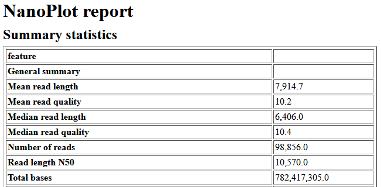

## Introduction
For the bioinformatics analysis of your genomes, we will be working in Galaxy. 

There are two main online galaxy platforms; the global server: [https://usegalaxy.org/](https://usegalaxy.org/){:target="_blank"} and the European server: [https://usegalaxy.eu/](https://usegalaxy.eu/){:target="_blank"}. The global version has a slightly larger set of programs than the European version. However, the European version runs in general slightly faster, and therefore you are recommended to use the European server. 

## Overview of Genome Assembly Processes
Next-generation Sequencing (NGS) generates DNA reads in parallel, which are massive amount of <s>short</s> sequences of nucleotides. The length of these reads depends on the sequencing platforms as well as the methods used for extracting the DNA. Short-read NGS platform such as Illumina generate an average read length of 2 x 150 bp to 2 x 300 bp with high accuracy. In the past decade, long-read sequencing have become a reality, with the two leading platform are PacBio and Oxford Nanopore Technologies. Current PacBio HiFi can generate up to 25kb reads with high accuracy, while Nanopore can generate ultra long reads (>900 kb) but with less accuracy. 

Long-read sequencing are crucial to solve assembly of complex genomic regions such as repeats, something that short-read could not achieve. A hybrid assembly (combining both the accuracy of short-reads and with long-reads to connect fragments) are used to generate a complete, high-quality genome. Nevertheless, the field is moving rapidly, opening a new avenues to look at microbial diversity at strain-level resolutions.

Because Nanopore sequencing results in so much longer reads, different bioinformatics tools need to be applied to process the data, as compared to the data generated by Illumina sequencing. Therefore, be careful to use bioinformatics programs, which are applicable for short or long reads depending on the dataset you have.  In this course we are solely working with Nanopore sequencing.

More information on sequencing techniques: 
- [https://www.nature.com/articles/nrg.2016.49](https://www.nature.com/articles/nrg.2016.49)
- [https://www.ncbi.nlm.nih.gov/pmc/articles/PMC6020069/](https://currentprotocols.onlinelibrary.wiley.com/doi/10.1002/cpmb.59)

<iframe allowfullscreen frameborder="0" style="width:640px; height:120px" src="https://lucid.app/documents/embeddedchart/2d2d642d-65ea-4f1b-a1e0-329c5ee118e9" id="J954-Kp1sEdf"></iframe>

Ryan Wick provides a nice ["Guide to bacterial genome assembly"](https://github.com/rrwick/Trycycler/wiki/Guide-to-bacterial-genome-assembly) as a starting point to choose which approaches and techniques to assemble your genome. He also write a nice comparison of different assembly tools: [https://f1000research.com/articles/8-2138](https://f1000research.com/articles/8-2138).

The general pipeline for processing nanopore reads into whole genomes are:
1.	Trimming and filtering reads
2.	Assembly of the reads into a genome
3.	Polishing the assembly 
4.	Analysing the genome

We will be using similar pipeline to the one suggested by Ryan Wick with several measures to check quality in between each steps.

## Importing Data into Galaxy
There are several ways we can input our data into Galaxy. We can upload datasets from our local machine, fetch from a public repository such as Zenodo, or reuse data from Galaxy history.

**We will inform you how to fetch your raw sequencing data when it is ready**. In the meantime, we can do an exercise using the data from **last year (2021)**, which are available from Aileen's (previous TA) history. 

Let's login to Galaxy and import this data into our history:
1. Go to [https://usegalaxy.eu/](https://usegalaxy.eu/){:target="_blank"}
2. Click `Login or Register`. Create an account and activate (if you hadn’t so)
3. Go to Aileen's history at: [https://usegalaxy.eu/u/aileen/h/nanoporesequencesmastercourse](https://usegalaxy.eu/u/aileen/h/nanoporesequencesmastercourse){:target="_blank"}
4. Import the data by pressing the `+` button on the upper right corner and click `import`. _Note that this only works if you are on the same server._
5. Rename the history to _"27255_raw_2021"_

<iframe src="https://drive.google.com/file/d/1_5GT66NGPE07TGLrI5CcaCF9ULCg_V0i/preview" width="640" height="480" allow="autoplay"></iframe>

> ## Discussion 01
> Each item in the history are the samples raw reads that has been demultiplexed. 
> 1. How many gigabytes of data are there?
> 2. How much data was generated for an average sample?
> 3. Why do we have uneven distribution of data for each samples?
> 4. What kind of information can you get from a FASTQ file? What are the differences with a FASTA format?
>
> > ## Solution
> >
> > TBD
> > 4. There are two main data formats which are relevant for your bioinformatics analysis. The first format is called FASTQ. It is usually used to store the raw reads (that is the nucleotide sequence string) together with their estimated quality(represented as ASCII bytes – not part of the curriculum). Data in fastq format can be identified by the endings: *.fq  or *.fastq. The other format is called fasta. It is used to store any sort of DNA or amino acid sequence. Data in fasta format can be identified by the endings: *.fasta, *.fa, *.fna, *.fas or *.fsa. To save storage space data files are often compressed. Most often used is a Gzip compression, which results in an added *.gz at the end of the file name for example: example.fq.gz or example.fa.gz. When uploading files to galaxy, files get automatically unzipped, so this should not be an issue. 
> {: .solution}
>
{: .challenge}

## Importing and editing a published workflow
We have prepared a template workflow that you can edit and use in your genome assembly and annotation. The template workflow are split into different steps with several measures for checking the quality in between steps.

Let's start by importing and exploring an initial QC workflow:
1. In a new tab, open this link: [https://usegalaxy.eu/u/matinnu/w/01rawqc](https://usegalaxy.eu/u/matinnu/w/01rawqc){:target="_blank"}
2. On the top-right corner, click the `+` button (import workflow) 
3. Click `start` using this workflow
4. Click on the name of the newly imported workflow (`imported: 01_Raw_QC`) and click `Edit`
5. Explore the workflow and make changes if necessary

<iframe src="https://drive.google.com/file/d/1bKF7NAiB9UHwlvctoNRTytAGQhqARbeM/preview" width="640" height="480" allow="autoplay"></iframe>

> ## Discussion 02
> 1. What is the input and final output of the workflow?
> 2. What are the purpose of the two main tools in the workflow?
> 3. Do you think [Kraken2](https://ccb.jhu.edu/software/kraken2/) is suited for long-read sequences?
>
> > ## Solution
> >
> > TBD
> {: .solution}
>
{: .challenge}

When you are contempt with the workflow, click save. Next, we will run the analysis on `barcode02.fastq` (the smallest dataset).
1. Click the _"play"_ button on the top-right corner (`Run Workflow`)
2. If the workflow does not show in detailed view, click `Expand to full workflow form`
3. Set `Send results to a new history` to `yes`. 
4. Change the history name to _"01_Raw_QC_2021_sample02"_.
5. On the `1: input dataset`, select `2: barcode02.fastq` as the input.
6. Click `Run Workflow` on the top panel.

<iframe src="https://drive.google.com/file/d/1VZUZLpFhFsUPLSHypuRXSp_blevFOfvX/preview" width="640" height="480" allow="autoplay"></iframe>

## Working with Galaxy history
In Galaxy, each analysis will run on different history. You can have multiple history and switch between history depending on your needs.

We just run a simple QC to our raw reads, and it might take a while for the jobs to finish. Note that we have made some of the intermediate jobs hidden.

<iframe src="https://drive.google.com/file/d/1_fvQfF07GWSTzJikYO19g0LUfQhWzpf8/preview" width="640" height="480" allow="autoplay"></iframe>

> ## Discussion 03
> When the job is done, let's look at the output of the jobs in the history.
> Open the Nanoplot result by clicking the "eye" (`view data`) icon.
> 1. Find out the value of these parameters:
>   - Total base
>   - N50
>   - Mean / Median Length
>   - Mean / Median Quality
>   - Your longest read
> 2. Note that this sample have 506.4 MB (Mega Bytes) of data and a 262.4 MBp (Mega Base Pairs) of reads. Which one is more appropriate to measure the sequencing yield?
> 3. What does N50 means? What is a good N50 value?
> 4. There are 66% of reads that are above Q10. What does this mean? What is a Q-score?
> 5. Do you think you have enough data for the assembly? What sequencing depth do you expect? How do you calculate a sequencing depth?
> 
> > ## Solution
> > 
> > Example of Nanoplot result
> >
> > {: .image-with-shadow :width="400px"}
> >
> > Before the assembly a quality check is necessary. For that we can use Nanoplot with default settings. Nanoplot gives several output files, but you can get an easy overview with the HTML report. The most important numbers there the mean read quality and the read length N50. The read quality is denoted as a Phred score and is for nanopore reads typicall not very high. Anything above 7 should be fine. If you want to know more, it is possible to calculate back from the Phred score to the estimated probability of erroneous base pairs. The N50 is a measurement for the contiguity or the mean read/contig length. It is defined as the sequence length of the shortest contig at 50% of the total genome length. Low N50 (<1000bp) of the nanopore reads usually indicate sheared DNA, which can occur due to problems during the library prep or DNA extraction. 
> {: .solution}
>
> Let's open the Krona Pie Chart to visualize the Kraken2 result.
> 6. What does Kraken2 says about the majority of the reads? What species are assigned?
> 7. Do you see potential contamination in your reads?
> 8. Would you trust Kraken2 result as the taxonomic placement of your assembly or do you want to try another approach? Which database are being used by Krona for the taxonomic assignment?
>
> > ## Solution
> >
> > TBD
> {: .solution}
>
{: .challenge}

## Concluding the QC Analysis
Based on the QC, we have good quality and sufficient amount of reads for the assembly. Nevertheless, we might improve our assembly by filtering out the shorter reads (and perhaps bad quality reads?), which we will do in the next steps.



